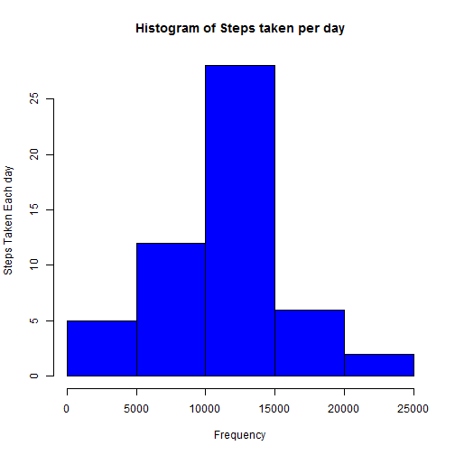
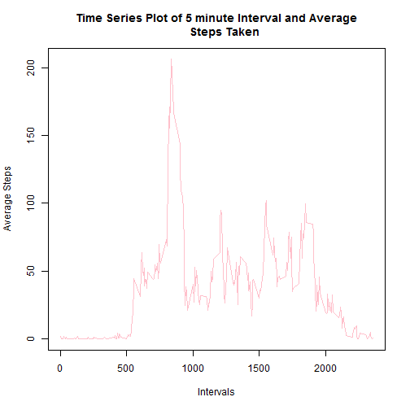
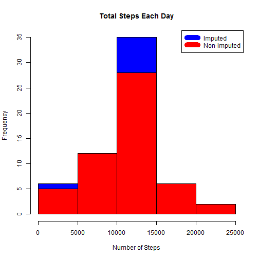

## Loading and preprocessing the data

```r
unzip("activity.zip")
data <- read.csv("activity.csv")
```


## What is mean total number of steps taken per day?

```r
#aggregate steps run each day
steps_per_day <- aggregate(steps ~ date, data, FUN=sum) 
hist(steps_per_day$steps, main = "Histogram of Steps taken per day"
     ,col = "blue", xlab = "Frequency", ylab = "Steps Taken Each day") 
```

 

```r
#calculate the mean and median and display it
rmean <- mean(steps_per_day$steps)
rmedian <- median(steps_per_day$steps)
```
### The mean number of steps are 1.0766189 &times; 10<sup>4</sup> and the median number of steps are 
### 10765 


## What is the average daily activity pattern?


```r
time_series_data <- aggregate(steps ~ interval, data, FUN=mean)

plot(time_series_data$interval, time_series_data$steps, 
     type="l", main="Time Series Plot of 5 minute Interval and Average
     Steps Taken", xlab = "Intervals", ylab = "Average Steps", col = "pink") 
```

 

```r
max_day <- time_series_data[which.max(time_series_data$steps),1]
max_day
```

```
## [1] 835
```
### The 835 5-minute interval contains the maximum number of steps. 


```r
totalmissingvalues <- sum(!complete.cases(data))
totalmissingvalues 
```

```
## [1] 2304
```


## Imputing missing values

### The total number of missing values are 2304  


```r
imputed_data <- transform(data, steps = ifelse(is.na(data$steps), time_series_data$steps[match(data$interval, time_series_data$interval)], data$steps)) 

imputed_data[as.character(imputed_data$date) == "2012-10-01", 1] <- 0
```

### Construct the histograms

```r
steps_by_day_i <- aggregate(steps ~ date, imputed_data, sum)
hist(steps_by_day_i$steps, main = paste("Total Steps Each Day"), col="blue", xlab="Number of Steps")

#Create Histogram to show difference. 
hist(steps_per_day$steps, main = paste("Total Steps Each Day"), col="red", xlab="Number of Steps", add=T)
legend("topright", c("Imputed", "Non-imputed"), col=c("blue", "red"), lwd=10)
```

 

### Calculate the new mean and median

```r
newmean <- mean(steps_by_day_i$steps)
newmedian <- median(steps_by_day_i$steps)
stepdiff <- sum(steps_by_day_i$steps) - sum(steps_per_day$steps) 
```


```r
meandiff <- newmean - rmean
mediandiff <- newmedian - rmedian
```
### The new mean is: 1.0589694 &times; 10<sup>4</sup> 

### The new median is: 1.0766189 &times; 10<sup>4</sup> 

### The difference between the new and old mean is: -176.4948964 

### The difference between the new and old median is: 1.1886792 

### The difference in the number of steps between the old and the new data is:
7.5363321 &times; 10<sup>4</sup>
## Are there differences in activity patterns between weekdays and weekends?

### Create a new factor variable for weekdays

```r
weekdays <- c("Monday", "Tuesday", "Wednesday", "Thursday", "Friday")
imputed_data$dow = as.factor(ifelse(is.element(weekdays(as.Date(imputed_data$date)),weekdays), "Weekday", "Weekend"))

steps_by_interval_i <- aggregate(steps ~ interval + dow, imputed_data, mean)

library(lattice)

xyplot(steps_by_interval_i$steps ~ steps_by_interval_i$interval|steps_by_interval_i$dow, main="Average Steps per Day by Interval",xlab="Interval", ylab="Steps",layout=c(1,2), type="l")
```

 

